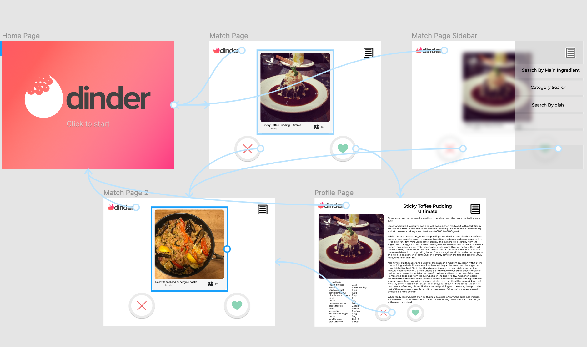
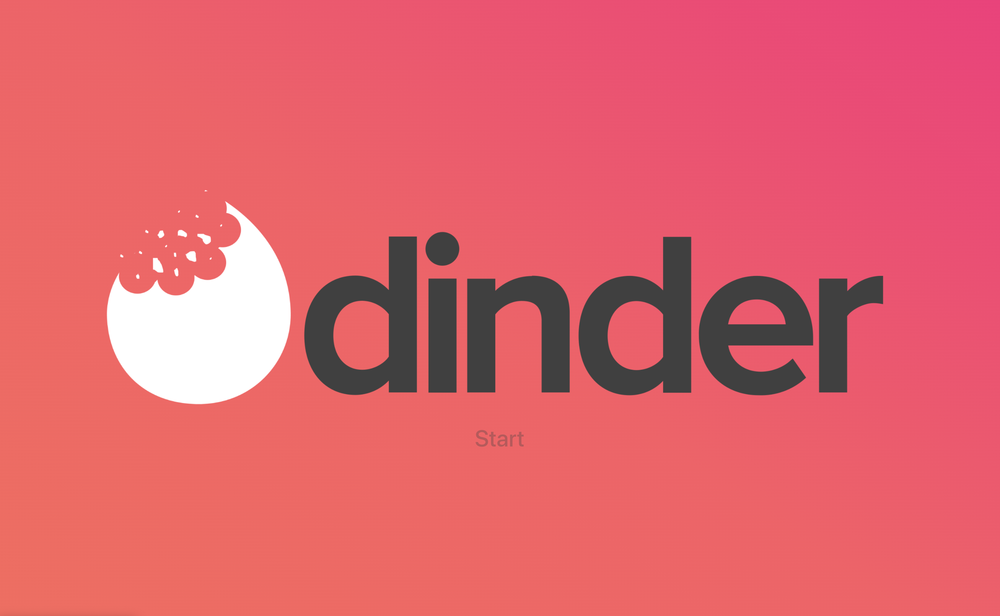
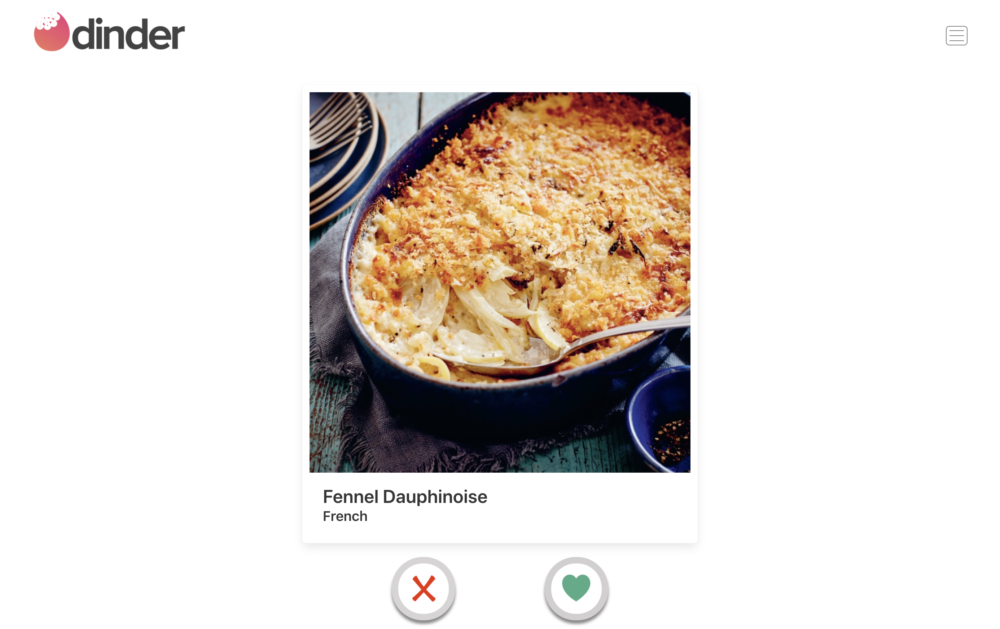
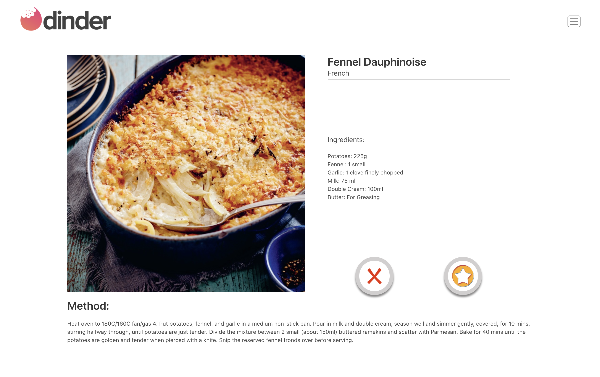
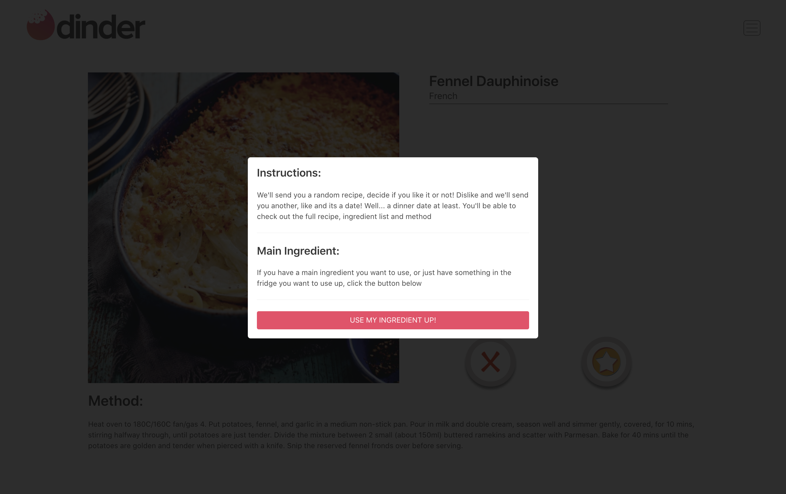
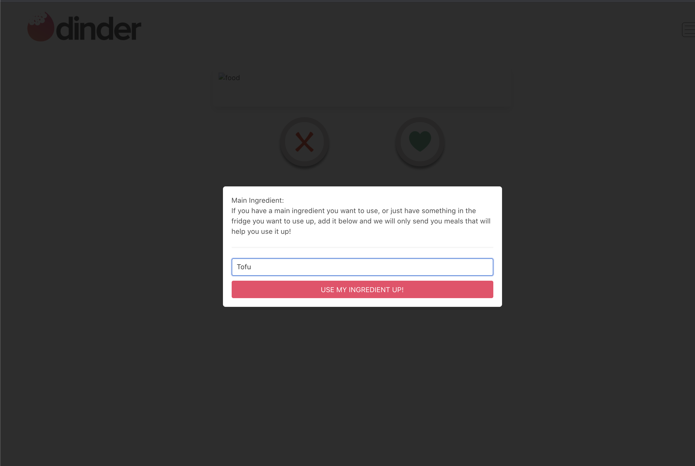
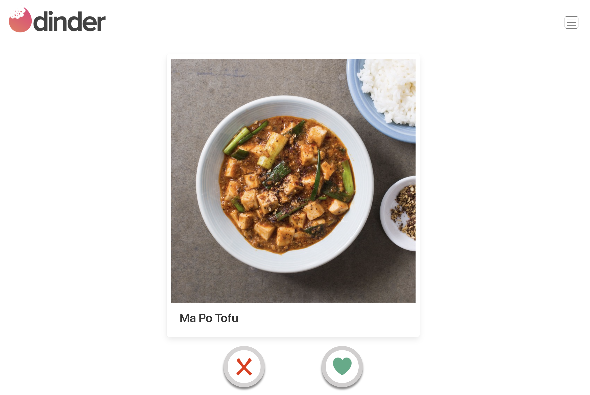

# SEI Project Two - Dinder

### Table of contents 
- Project Overview
- The Brief
- Technologies Used
- Approach Taken - (screenshots and featured code)
- Wins & Blockers
- Bugs
- Future Content and Improvements
- Key Learnings
- Original Planning Notes

---

# Overview
Dinder is a parody of the dating app Tinder. Only, instead of finding an actual date - Dinder will help you decide what to cook for your next meal. This was a 2-day hackathon project that was pair coded and my first experience of using a public API and building the front-end in React.

## You will find the deployed version here: **[Dinder](https://dinder.netlify.app/dinder)**


## Code Installation:
- Clone or download the repo
- Install Yarn in terminal with command:  `yarn`
- Start server with terminal command: `yarn start`


# The Brief
* **Consume a public API** – this could be anything but it must make sense for your project
* **Have several components** - At least one classical and one functional
* **The app can have a router** - with several "pages", this is up to your disgression and if it makes sense for your project
* **Include wireframes** - that you designed before building the app
* **Be deployed online** and accessible to the public

# Technologies Used

### Front-end:
- React
- JSX
- Axios
- Bulma
- SCSS
- React Router Dom

### API Used:
- The Meal DB - https://www.themealdb.com/

### Dev tools:
- VS code
- Yarn
- Insomnia
- Git
- Github
- Google Chrome dev tools
- Figma (Wireframeing)
- Netlify (deployment)


# Approach Taken

**Planning and Preparation:**\
Because this project's deadline was less than 48 hours after being given the brief - Myself and Tom had to quickly get a plan together. We spent the first evening searching for an apporopriate API to use. With the idea that we wanted to do an app based around recipies and food we used Insomnia to test the responses to make sure we were getting what we needed. We settled on **[TheMealDB's](https://www.themealdb.com/)** API.

This API allowed us to:
- GET a random recipe from the full database
- GET a selected recipe based on its ID
- GET a random recipe based on an ingredient that a user had inputted

This then lead us to think of creating a parody app based on Tinder. From here we were then able to create a storyboard and wireframe for the app using Figma. 

### Storyboard screenshot:


Now that we were happy with the design and API, we were able to start building the front-end. This was built using **React**. We decided to pair code the project using VS Code's Live Share functionality. This initially enabled us to work on building out the JSX frame for each page together and then eventually delegating the work between us for different sections. 


**DinderRandom:**\
For the API requests we set up a lib file and used **Axios** to get the data. Initially I started by using console.logs to check in the chrome dev tools that we were able to getting the right responses on the front end and then moved onto using that data to show the images and title for the DinderRandom page.

We then created the buttons which would either 'like' and take you to the recipe page or 'dislike' and get you a new random recipe. Once the buttons were functioning then we were able to move onto the DinderMatch page

**DinderMatch:**\
The DinderMatch page was where we came up against one of our biggest blockers for the project so far. Where the ingredients and measurements for the recipe were sent back individually in the JSON response. To get around this We used a function to map over the ingredients and create an array which we could then manipulate and show the data correctly

```
const ingredientsList = []
const getIngredientsList = () => {
  const ingredients = []
  const measures = []
  const array = Object.entries(this.state.meals.meals[0])
  array.map(key => {
    if (key[0].search('Ingredient') > 0 && key[1]) {
      ingredients.push(`${key[1]}`)
    }
    if (key[0].search('Measure') > 0 && key[1]) {
      measures.push(`${key[1]}`)
    } 
  })
  for (let i = 0; i < ingredients.length - 1; i++) {
    if (ingredients[i]) {
      ingredientsList.push(`${ingredients[i]}: ${measures[i]}`)
    }
  }
}
getIngredientsList()
```


**Styling method:**\
Throughout the build process we used the Bulma CSS framework for its ease and efficiency. This allowed us whilst building out the project to keep stying in mind when creating the JSX in React - Adding the necessary classes to each tag to help speed up the styling process at the end.


**MVP & NTH's:**\
We had decided early on in the project that for MVP we would have the random page and recipe show page working well and that the search ingredient and add to favourites would be part of the 'Nice To Haves'. By the end of the day we had successfully got the random recipe and recipe show pages working and styled nicely so we decided to spend the last few hours before deadline on the friday adding in one of the NTH's. 

**Navbar, Instructions and Ingredient Match Modals:**\
I set about using the Bulma Modal to add in the functionality for ingredient search. The Modal was added into the Navbar component which meant that you could access it from anywhere within the app. The first modal would show you the instructions for the app and tell the user about the ability to add in their own ingredient. If they then clicked the button it would then take the user to the DinderIngredientRandom page with the Modal open for them to add in their ingredient. Once the user has added in the ingredient and clicked the button this then sends a request to the API with the ingredient as the argument and would then respond with an array of recipies that include the ingredient. I then set the state to show a random recipe from this array

```
getRandomItem = () => {
  const mealsArray = { ...this.state.mealsArray.data }
  if (mealsArray.meals === null) {
    this.props.history.push('/notfound')
  } else {
    const randomNumber = Math.floor(Math.random() * mealsArray.meals.length)
    // console.log(mealsArray.meals[randomNumber])
    this.setState({ meal: mealsArray.meals[randomNumber], gotRandom: true })
  }
}
```

This was the first time using React and I am pleased with being able to add this functionality and manipulating the state to open and close the modals and send API requests - which helped with creating such a slick working app.


# Finished Product
Homepage:


--- 
Random Recipe generator:


---
Liked Recipe show page:


---
Instructions Modal:


---
Add Ingredient Modal:


--- 
Ingredient Search results:



# Wins & Blockers
### **Wins:**
- Overall I am very happy with the styling of the product
- Very happy that we were able to add in the ingredient search as this is a very useful feature and takes the app to the next level
- It was my first experience of pair coding on a project and I feel I learnt a lot about working this way. Using driver/typing methods as well as delegating work between us. Then working through issues together and sudo coding through problems. A very good learning experience
### **Blockers:**
- One of the main blockers was that the ingredients and measurements were in separate responses from the api - so it took a bit of time to just get the right info showing correctly on the page. This was initially done in a very long function with each of the (up to) 20 ingredients and measurements being hard coded. This was then refactored using the Map method, where each ingredient was put into an array and the same for the measurements. Their index's would then match up and be much more useable and accessable data for the page.

# Bugs
- Add to favourites button currently has no functionality
- When clicking through to the DinderIngredientRandom page - the modal is open but there is no content so you can see behind the modal that there is an error as there is no recipe to show
- When clicking out of a DinderIngredientRandom recipe show page it will take you back to all recipes and not back to recipes with the inputted ingredient.

# Future Content & Improvements
- Users being able to log in and add the recipes to their favourites
- Swipeable actions and styling to get a more realistic 'Tinder' experience
- Categories for different meals (breakfast, lunch, dinner etc.)
- Fix all above bugs!

# Key Learnings
This was my first project working in a pair and I feel that I definitely learnt a lot from this experience. It felt very positive having someone else working towards the same goal and solving problems together. I also felt that the process of pair coding really meant that I had to think more about the way I am doing things, in terms of sudo-coding through problems and getting them down in code. It really helped me take a step back from just throwing things into the code and into having to work things out in a step by step manner beforehand.

---
---
---

# Original planning notes below:

## Dinder requirements

### Pages

- Home Page - front end URL - '/'

- DinderRandom - Front end URL - '/dinder'
             - Back end - GET RANDOM RECIPE

- DinderMatch - Front end URL - '/dinder/:id
            - Back end URL - GET SINGLE RECIPE BY ID

- Options - (navbar burger style with form on open) - This has Category option & main ingredient option which then filters the get random page by this data inputted by the user

- Error - when a user navigates to an incorrect page

## Nice to haves:
- Log in page - 
- Favourites page - for logged in user
- Categories Drop-down
- Animation for swiping
- change tab logo include dinder logo

### Dependancies
react-router-dom
Bulma
axios


